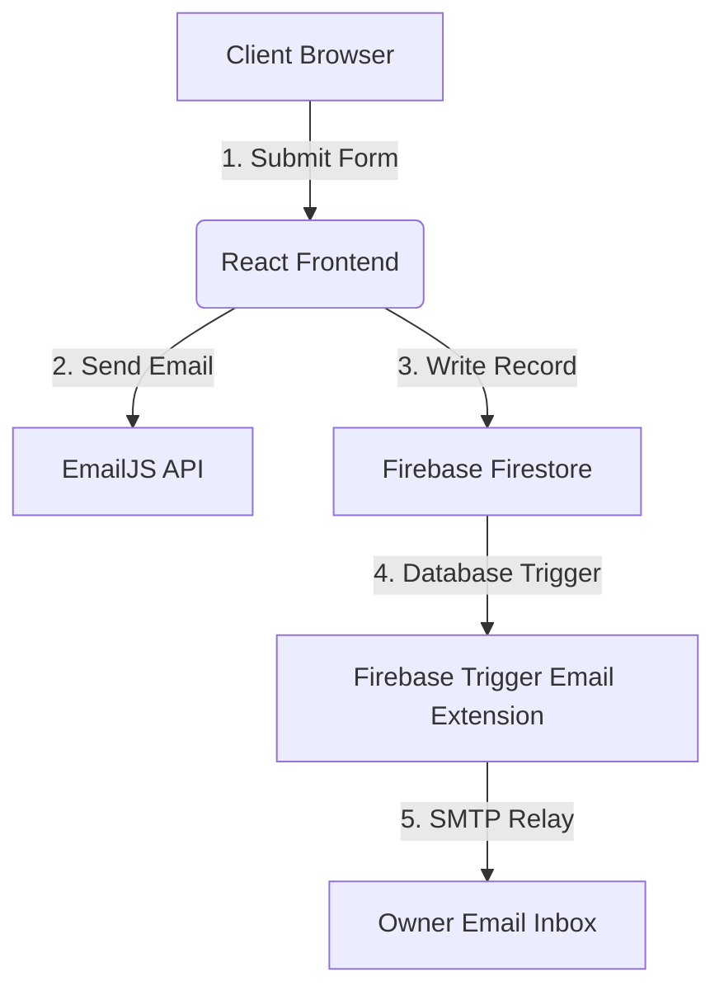

# Northgate Education - Backend Integration & Next Steps Guide

This document outlines the current state of the migrated Northgate Education frontend and provides a step-by-step implementation plan for the backend.

---

## 1. Frontend Migration Status: Complete & Verified

The frontend migration from the legacy static HTML site to **React 19** and **Vite** is **100% complete**. 

* **Stateful Refactoring**: All elements (scroll-responsive Navbar, Services Accordions, infinite marquee tracks, responsive Alumni Slider, and FAQs) are converted to clean, stateful React components.
* **Build Verification**: Compiles with **zero errors or warnings** using Vite's production bundler.
* **Unified Form Handling**: The single, powerful form in the `ContactForm` component handles both booking consultations and test prep (SAT/IELTS) brochure requests via the **"Program of Interest"** selector.

---

## 2. Recommended Backend Architecture: Firebase Serverless

For a modern, high-performance, and low-cost website, a **Firebase Serverless Architecture** is the ideal solution. You do not need to manage a custom Node.js/Express server or pay for running virtual machines.



### Why this idea is suitable:
1. **Firestore Database**: A flexible, NoSQL cloud database that stores submission records in real-time.
2. **Trigger Email Extension (Firebase)**: A pre-built extension that automatically sends rich HTML emails via an SMTP provider (e.g., SendGrid, Gmail, Mailgun) whenever a new document is added to a specific Firestore collection.
3. **EmailJS (Pre-configured)**: We have already integrated EmailJS directly in the React frontend, which sends client inquiry notifications immediately to `fedrickengels9@gmail.com` on submission.

---

## 3. Step-by-Step Backend Implementation Guide

Follow these steps to transition from your current development environment to a fully operational Firebase backend:

### Step 3.1: Create a Firebase Project
1. Go to the [Firebase Console](https://console.firebase.google.com/).
2. Click **Add Project** and name it `Northgate Education`.
3. In the project dashboard, click **Build > Firestore Database** and select **Create Database**.
4. Start in **Production Mode** and choose a database location closest to your target audience (e.g., `asia-south1` for India).

### Step 3.2: Configure Environment Variables
We have wired `src/firebase.js` to read configuration from environment variables. Create a file named `.env` in your root directory and populate it with your credentials from the Firebase Console (Project Settings > General > Your Apps):

```env
VITE_FIREBASE_API_KEY=your_api_key_here
VITE_FIREBASE_AUTH_DOMAIN=your_auth_domain_here
VITE_FIREBASE_PROJECT_ID=your_project_id_here
VITE_FIREBASE_STORAGE_BUCKET=your_storage_bucket_here
VITE_FIREBASE_MESSAGING_SENDER_ID=your_messaging_sender_id_here
VITE_FIREBASE_APP_ID=your_app_id_here
VITE_FIREBASE_MEASUREMENT_ID=your_measurement_id_here
```

> [!IMPORTANT]
> The prefix `VITE_` is required by Vite to expose these variables to your client-side React code.

### Step 3.3: Configure Firestore Rules
To allow your frontend form to write records directly to Firestore, go to the **Rules** tab in the Firestore Console and set the security rules to allow writes:

```javascript
rules_version = '2';
service cloud.firestore {
  match /databases/{database}/documents {
    match /submissions/{document} {
      // Allow anybody to submit an inquiry form, but restrict reading/deleting to admin
      allow write: if true;
      allow read, update, delete: if false; // Add custom auth rules here later for admin portal
    }
  }
}
```

### Step 3.4: Automated Email Notifications (Choose one)

#### Option A: EmailJS (Client-Side) - *Already Implemented*
We integrated the original EmailJS credentials in `ContactForm.jsx`. When a client submits a form, EmailJS triggers a template to send details directly to the owner. This works out of the box.

#### Option B: Trigger Email Extension (Database-Triggered) - *Highly Recommended*
To make the email system more reliable (so emails are sent even if the user closes their browser before EmailJS finishes):
1. In the Firebase Console, go to **Extensions**.
2. Find and install the **Trigger Email** extension.
3. Configure it to listen to the `submissions` collection.
4. Input your SMTP provider details (e.g., SendGrid, Mailgun, or your custom domain email server).
5. The extension will automatically monitor Firestore and send email alerts whenever new data is saved.

---

## 4. Deploying the Website

To host the React website on Firebase's global CDN:

1. Install the Firebase CLI:
   ```bash
   npm install -g firebase-tools
   ```
2. Log in and initialize the project:
   ```bash
   firebase login
   firebase init
   ```
   * Choose **Hosting**.
   * Select your existing Firebase project.
   * Set the public directory to `dist` (Vite's build output folder).
   * Configure as a single-page app: **Yes**.
3. Build and deploy:
   ```bash
   npm run build
   firebase deploy
   ```

Your site will be live on a secure, fast `web.app` subdomain (e.g., `northgate-education.web.app`) for free!
